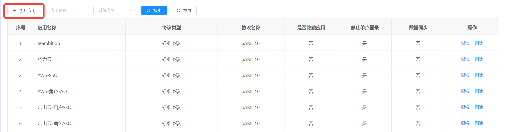
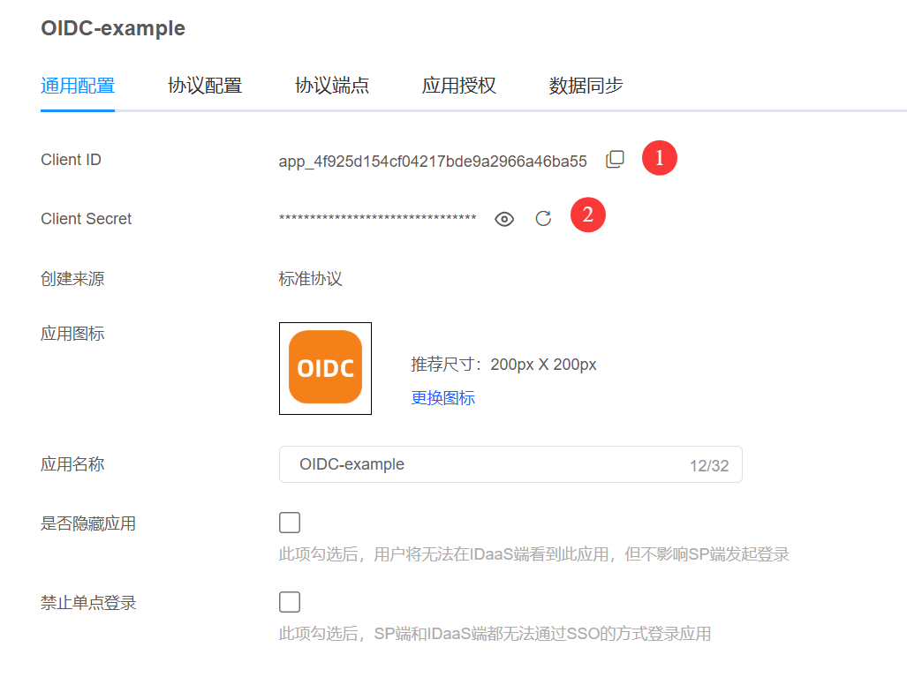
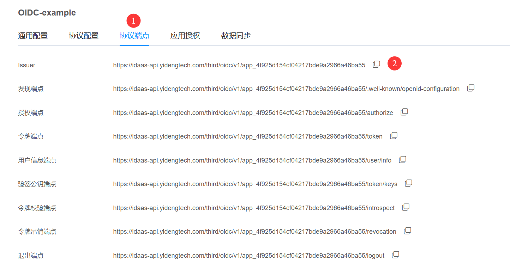
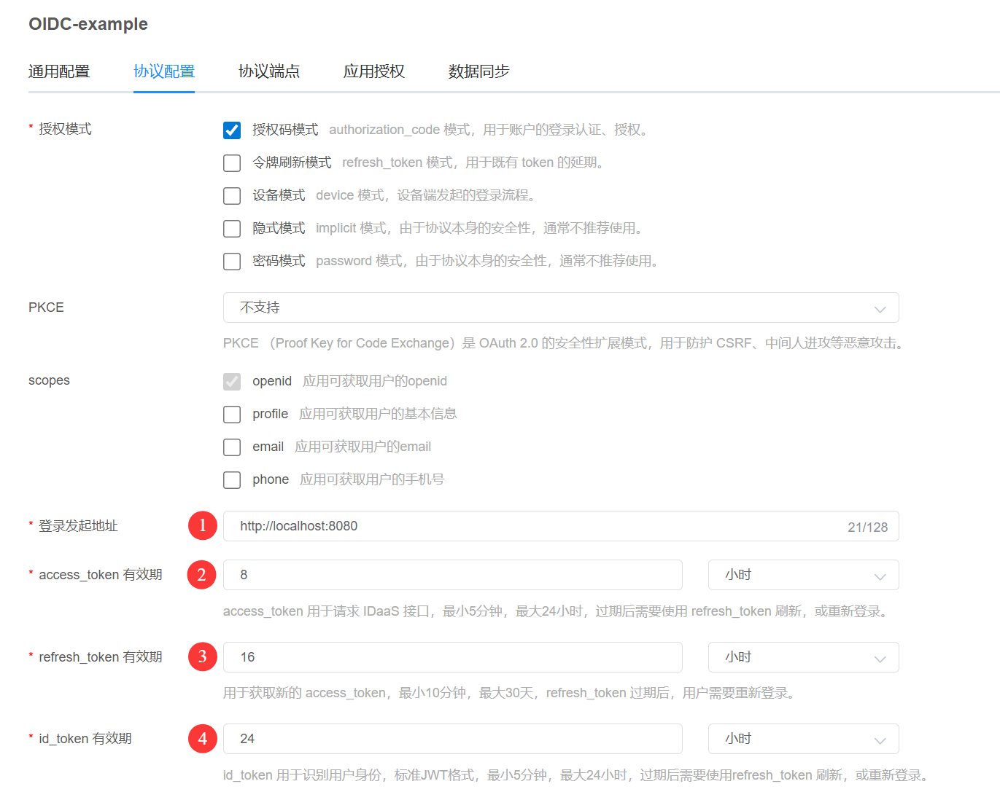
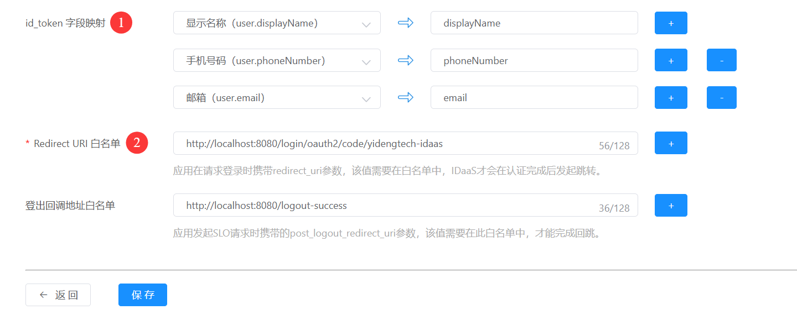
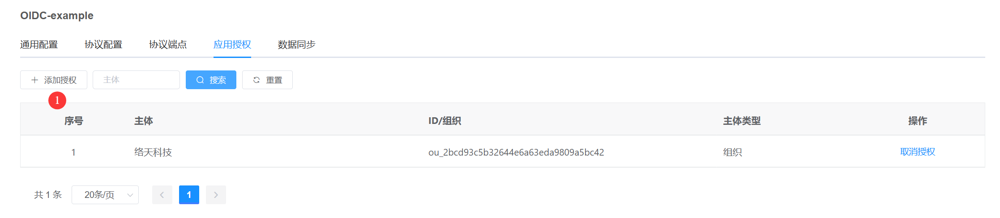
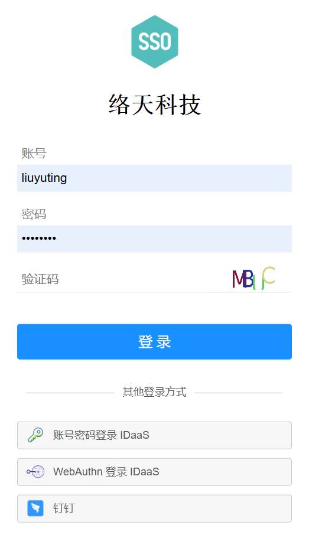
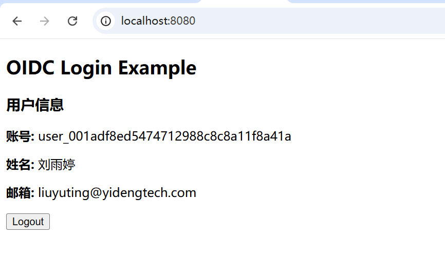

# Spring Boot OIDC 单点登录(SSO)实战教程：授权码模式详解与主流IAM厂商对接

这是一个基于springboot，使用OIDC协议实现单点登录的完整示例，源码下载后开箱即用。

本文档将深入介绍如何使用 OIDC (OpenID Connect) 协议实现企业级 单点登录 (Single Sign-On, SSO)。无论您的应用要对接自己的还是第三方的统一身份认证平台，或 Keycloak、Okta、Auth0、AWS Cognito、Microsoft Entra ID，本教程提供的标准 OIDC 授权码模式 (Authorization Code Flow) 配置步骤均能完美适配。

更多信息，[您也可以点击此处，详细了解OIDC协议各模式的时序和参数](https://www.yidengtech.com/240.html)。

## 为什么选择本教程进行OIDC开发？
在对接国际主流身份提供商（IdP）时，国内开发者常面临 外网访问延迟高、调试响应慢 以及 技术支持沟通困难 等挑战。为了让您更专注于 OIDC 协议 本身的逻辑与代码实现，本示例特别采用国内领先的 亿登科技 IDaaS (EIAM) 作为授权服务器进行演示。
亿登IDaaS 完全遵循 OIDC 标准协议，其 授权码模式 的配置逻辑与 Keycloak、Okta、Auth0 等国际大厂高度一致。通过本教程，您不仅可以利用国内节点享受极速调试体验，更能掌握通用的 SSO 集成技能，轻松迁移至任意全球主流云平台。
## 🚀 快速开始：1分钟获取免费OIDC测试环境
立即开启您的 单点登录 开发之旅：
👉 立即访问 [亿登科技官网](https://www.yidengtech.com/)
- 极速注册：仅需 1分钟 即可快速注册免费账号。
- 开箱即用：预置标准 OIDC 应用模板，支持 授权码模式 快速配置。
- 国内加速：专为国内开发者优化，彻底解决外网 Okta/Auth0/AWS 等服务访问慢的问题。
## 本文将涵盖的核心技术点
- OIDC 协议核心解析：深入理解 授权码模式 (Authorization Code Flow) 的交互时序与安全性。
- 通用集成步骤：适用于 Keycloak, Okta, Auth0, AWS Cognito, Azure AD (Entra ID) 的标准配置流程。
- 亿登IDaaS实战演练：如何在控制台创建OIDC应用、获取 Client ID/Client Secret 并配置回调地址 (Redirect URI)。
- 代码示例与调试：提供完整的后端验证代码，助您快速打通 单点登录 闭环。
无论您是需要为 AWS Cognito 做前期验证，还是正在寻找 Okta 的替代测试方案，本文都将为您提供一套高效、通用的 OIDC SSO 解决方案。

### 步骤 1：登录 IDaaS 控制台
- 亿登 IDaaS 控制台登录地址：https://console.yidengtech.com/


### 步骤 2：创建应用
创建一个标准协议的 OIDC 应用

<table>
   <tr>
      <td style="border: 1px solid black; padding: 0;">
         
       </td>
   </tr>
</table>

## 步骤 3：修改配置

修改`application.yml`中 OIDC 的相关配置项


```yaml
spring:
  security:
    oauth2:
      client:
        registration:
          yidengtech-idaas: # 自定义 provider id
            client-id: # 你的应用在 IDaaS 平台注册后分配的 Client ID（应用ID）
            client-secret: #（应用ID）对应的 Client Secret（应用密钥），注意保密
            scope:
              - openid # 请求的权限范围（scopes），多个用逗号分隔。
        provider:
          yidengtech-idaas:
            issuer-uri: # 签发者标识
```

参考下面2张图的标示，完成上面配置文件的修改。

<table>
   <tr>
      <td style="border: 1px solid black; padding: 0;">
         
       </td>
   </tr>
</table>

<table>
   <tr>
      <td style="border: 1px solid black; padding: 0;">
         
       </td>
   </tr>
</table>

### 步骤 4：在 idaas 中添加 sp 配置

- 登录发起地址：是本地应用的访问地址。
- 其它值根据您的实际情况填写。

<table>
   <tr>
      <td style="border: 1px solid black; padding: 0;">
         
       </td>
   </tr>
</table>

- id_token字段映射（可选）
- Redirect URI 白名单：是 IDaaS 认证完成后跳转回本地应用的地址，格式：{baseUrl}/login/oauth2/code/{registrationId}，本地调试请填写：http://localhost:8080/login/oauth2/code/yidengtech-idaas

<table>
   <tr>
      <td style="border: 1px solid black; padding: 0;">
         
       </td>
   </tr>
</table>

### 步骤 5：应用授权

配置那些用户有权限登录此应用

<table>
   <tr>
      <td style="border: 1px solid black; padding: 0;">
         
       </td>
   </tr>
</table>

### 步骤 6：用户登录

- 访问 `http://localhost:8080`，完成登录。

<table>
   <tr>
      <td style="border: 1px solid black; padding: 0;">
         
       </td>
   </tr>
</table>

### 步骤 7：登录成功

- 用户登录成功后会跳转到原地址：`http://localhost:8080`

<table>
   <tr>
      <td style="border: 1px solid black; padding: 0;">
         
       </td>
   </tr>
</table>
